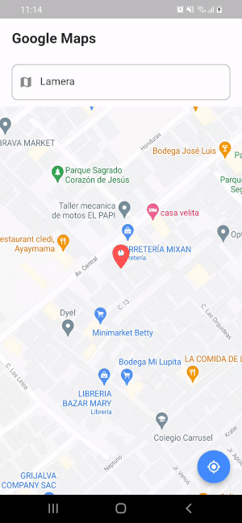

<h1 align="center">Google Maps Marker in Center using GetX</h1>

# Introduction

This repository contains Google Maps Marker in Center of Page. The is implemented using GetX State
Management.

## 📱 Demo #

   

## ⚙️ Built with Amazing Tools

* [Flutter](https://flutter.dev/) - Beautiful native apps in record time.
* [Android Studio](https://developer.android.com/studio/index.html/) - Tools for building Awesome
  apps on every type of Android device.
* [Visual Studio Code](https://code.visualstudio.com/) - Code editing. Redefined.
* [GetX](https://pub.dev/packages/get/) - Easy State Management tool.

## 🤝 Show Some Support #

If you liked the app please give this repo a ⭐️

## 🐞 Bugs/Requests #

If you encounter any problems feel free to open an issue. If you feel the library is missing a
feature, please raise a ticket on Github and I'll look into it. Pull request are also welcome.#
whatsapp-redesign